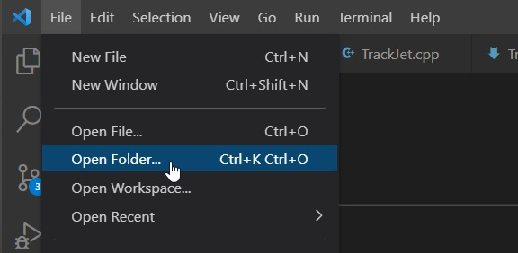
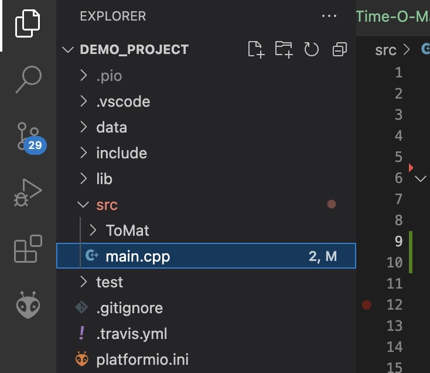
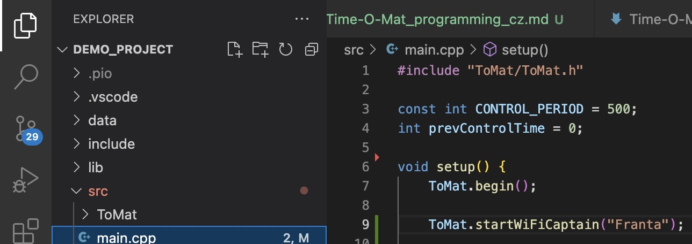
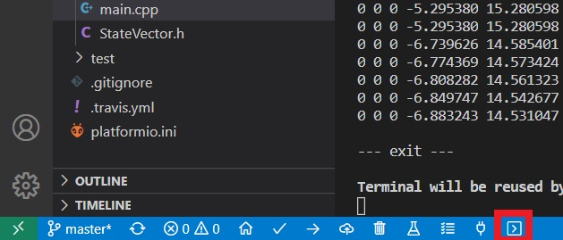
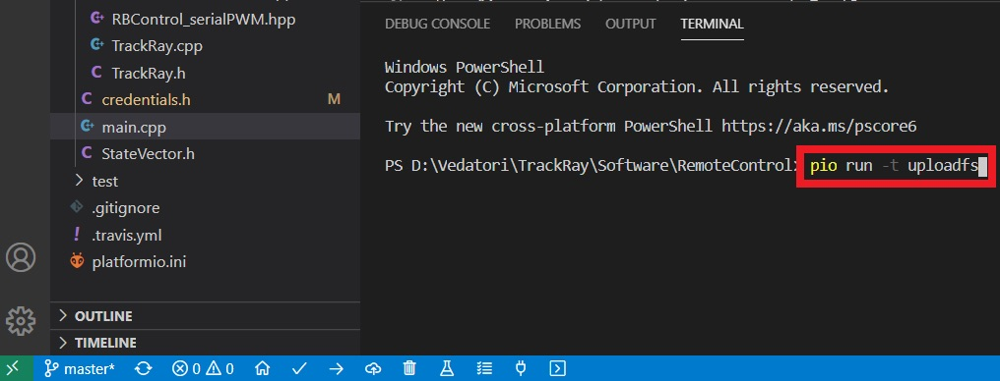
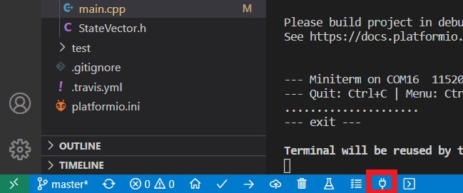
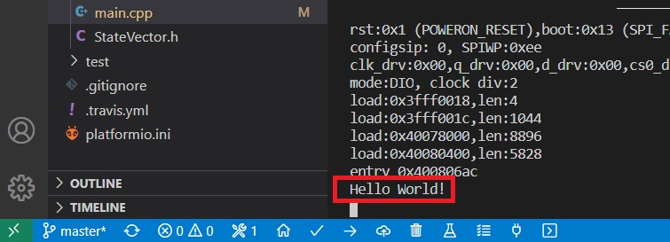

Toto je návod na programování výrobku PaLampa. Začneme instalací vývojového prostředí na váš PC, následně si ukážeme základní pravidla programovacího jazyka C++ a poté začneme využívat funkce výrobku PaLampa.

V tomto návodu se budeme zabývat programováním mikrokontroléru (mikropočítače) ESP32. K tomu je od výrobce ESP32 připraven framework (sada nástrojů urychlujících vývoj) ESP-IDF v jazyce C. Nadstavbou tohoto frameworku je další framework [arduino-esp32](https://github.com/espressif/arduino-esp32), který přidává další sadu nástrojů a je již napsán v jazyce C++. Framework Arduino-esp32 používáme pro programování výrobku PaLampa. Bylo k němu potřeba přidat množství kódu (knihovna *PaLampa*), který se stará o *základní životní funkce* a umožňuje jednodušší používání jeho funkcionalit (z `main.cpp`). V tomto návodě se budeme zabývat jen uživatelským pohledem na používání knihovny *PaLampa*.

___
# Obsah

* [Vývojové prostředí](#IDE)
* [Nahrání demo programu - kontrola](#kontrola)
* [Ovládání demo programu](#ovladani)
* [Nový projekt](#novyprojekt)
* [První program](#prvniprogram)
* [Komentáře](#komentare)
* [Proměnné](#promenne)
* [Podmínky](#podminky)
* [Cyklus](#cyklus)
* [Funkce](#funkce)
* [LEDky](#ledky)
* [Tlačítka](#tlacitka)
* [Piezoakustický měnič](#piezo)
* [Fotorezistory](#fotorezistory)
* [Dotyková lišta](#lista)
* [Teploměr](#teplomer)
* [Sériová linka](#seriovka)
* [Pokročilé ovládání LED](#ledky2)
* [WiFi](#wifi)
* [Vzdálený příkazový řádek](#prikazy)
___

<!-- _________________________________________________________________ -->
# <a name = IDE>Vývojové prostředí</a>

Pro programování PaLampa je použito vývojové prostředí [Visual Studio Code](https://code.visualstudio.com/download) s rozšířením PlatformIO. Pro instalaci prostředí a rozšíření můžete použít tento [návod](https://docs.platformio.org/en/latest/ide/vscode.html#installation), jehož hlavní část je na obrázku níže:


<!-- _________________________________________________________________ -->
# <a name = kontrola>Nahrání demo programu - kontrola</a>

V této části nahrajete do PaLampa připravený program pro jeho otestování a poskytující základní funkcí výrobku.

Pro naprogramování výrobku je potřeba si stáhnout knihovnu s připraveným software. Toho je možné dosáhnout dvěma způsoby. 
* Jednodušším způsobem je stažení [tohoto repozitáře](https://github.com/vedatori/PaLampa/archive/refs/heads/main.zip). Stáhnutý soubor *PaLampa-main.zip* si rozbalte na disk svého PC na libovolnou lokaci tak, abyste ho našli. Tento způsob má však z dlouhodobějšího hlediska nevýhody jako náročnější aktualizaci software a nemožnost kooperace ve vývoji.
* Složitějším způsobem je použití programu [Github Desktop](https://desktop.github.com) případně jiného Git klienta. Po instalaci Github Desktop si zkopírujte [URL adresu tohoto repozitáře ve webovém prohlížeči](https://github.com/Vedatori/PaLampa/). Po stisku tlačítek *Add*, *Clone repository* a *URL* zadejte do Github Desktop zkopírovanou adresu a potvrďte klonování repozitáře na váš lokální disk, nejlépe do nabízené souborové cesty.

**Pozor:** PlatformIO nedokáže pracovat s diakritikou v cestě souborového systému k projektu. Všechny projekty musí být uloženy v cestě bez háčků a čárek!
Pokud vaše uživatelské jméno obsahuje diakritiku, tak nemůžete používat Plochu ani složku Dokumenty, ale musíte vytvořit například *C:/Vedatori/PaLampa-main*.

Ve VS Code otevřete nabídku *File*, klikněte na *Open Folder* a zvolte složku *Software/demo_project* ze stažené složky-repozitáře *PaLampa*.



Otevřete soubor *main.cpp* který je v cestě *demo_project/src/main.cpp*.



V souboru *main.cpp* upravte název výrobku "<your_name>" tak, aby byl poznatelný, např. jako "Jirka" nebo "Blanka".
Je možné přidat i heslo pro přihlašování např. takto
`paLampa.startWiFiCaptain("<your_name>", "12345678");`.
Heslo musí mít minimálně 8 znaků, jinak nebude použito.



Po otevření projektu bude VS Code chvíli pracovat. Pokud ještě pracuje, počkejte, dokud text na dolní liště nezmizí.


Připojte PaLampa pomocí USB-C kabelu k PC.

V dolní liště PlatformIO stiskněte šipku a tím nahrejte program do výrobku.


Počkejte, až se dokončí nahrávání a zobrazí v dolním terminálu *SUCCESS*.


V dolní liště PlatformIO stiskněte tlačítko úplně v pravo a tím spusťe PlatformIO terminál.



Do nově otevřeného termínálu v dolní částí VS Code zadejte příkaz `pio run -t uploadfs` a stiskněte *ENTER*. Tímto nahrajeme soubory webových stránek hostovaných ve výrobku pro jeho ovládání a další potřebné soubory.



Počkejte, až se dokončí nahrávání a zobrazí v dolním terminálu *SUCCESS*.


Nyní je výrobek plně naprogramován. Pro ovládání na svém chytrém zařízení vyhledejte WiFi síť s názvem *PaLampa_<your_name>*. Zadejte do webového prohlížeče adresu *192.168.4.1* nebo jakoukoli jinou ve tvaru *www.neco.cz*. Načte se hlavní stránka pro ovládání PaLampa.

Pro přihlášení PaLampa k externí WiFi síti klikněte na tlačítko *WiFi setup*. Po delší chvíli se zobrazí stránka s dostupnými WiFi sítěmi. Zde zadejte přihlašovací údaje od externí WiFi a potvrďte přihlášení. Pro úspěšné přihlášení k externí WiFi síti může být potřeba ještě restart výrobku.


Pokud přihlášení k externí WiFi proběhne úspěšně, objeví se potvrzení *connected* a přidělená IP adresa. Tato síť bude uložena a vyhledána i po restartu. Připojte se se svým chytrým zařízením také na externí WiFi a zadejte do prohlížeče IP adresu přidělenou PaLampa. V tomto případě *192.168.88.197*.


Načte se opět hlavní stránka ovládání PaLampa. Po několika minutách bez připojeného zařízení na interní WiFi síťi *PaLampa_<your_name>* bude tato síť vypnuta. Pro její opětovné zapnutí přejděte do nastavení WiFi a klikněte na tlačítko *Enable AP* nebo restartujte PaLampa.


Demo program umožňuje také následující nastavení výrobku:
* Nastavení jasu a barvy světla pomocí tlačítek a potenciometru.

<!-- _________________________________________________________________ -->
# <a name = ovladani>Ovládání demo programu</a>

Výrobek je možné skrze právě nahraný demo program uživatelsky ovládat a nastavovat jeho parametry. Jedná se o uživatelské funkce PaLampa SW knihovny, které jsou zpravidla nastaveny v hlavním souboru *main.cpp*. Zde je také možné je jednoduše měnit a přizpůsobovat si funkčnost PaLavýrobkumpa. Demo program je možné ovládat násedujícími způsoby:

## Fyzická tlačítka a dotyková lišta
* Nastavení jasu světla:
* Nastavení barvy světla:
* Nastavení času:
* Zahrání táborové znělky: Stiskem ______ spustíme demo skladbu *We are not going to make it*.
* Reset:

## Webové rozhraní
* Nastavení času: Do pole *Command entry* zadáme příkaz je ve tvaru `settime HH MM`. Parametry `HH` a `MM` odpovídají hodinám a minutám. Například pro nastavení času 12:34 použijeme příkaz `settime 12 34`. Příkaz odešleme stiskem tlačítka *Enter*.
* Nastavení časové zóny: Do pole *Command entry* zadáme příkaz je ve tvaru `setzone X`. Parametr `X` je textový řetězec (kód) popisující danou časovou zónu. [Seznam časových zón a jejich kódů je zde](https://github.com/nayarsystems/posix_tz_db/blob/master/zones.csv). Například pro nastavení české časové zóny včetně časových posuvů použijeme příkaz `setzone CET-1CEST,M3.5.0,M10.5.0/3`. Změna času po úspěšné změně časové zóny se za dostupného internetu projeví okamžitě. Pozor, v případě zadání nesprávného kódu časové zóny bude automatická sychronizace času vypnuta (neprobíhá kontrola validnosti zadaného kódu).
* Nastavení barvy světla: Do pole *Command entry* zadáme příkaz je ve tvaru `rgb R G B`. Parametry `R`, `G` a `B` odpovídají jednotlivým hodnotám RGB kódu zvolené barvy v rozsahu 0-255. Například pro nastavení zelené barvy použijeme příkaz `rgb 0 255 0`. Příkaz odešleme stiskem tlačítka *Enter*.

<!-- _________________________________________________________________ -->
# <a name = novyprojekt>Nový projekt</a>

Vytvoříme nový projekt a nahrajeme program do PaLampa.

## Postup
Vytvořte si na disku svého PC složku pro vaše budoucí programy, například *C:/user/Dokumenty/PaLampa-programy*.

Do této nové složky překopírujte soubor ze stáhnutého repozitáře *Software/demo_project/src/main.cpp* ze stáhnutého repozitáře *PaLampa-main*. V nové složec si soubor přejmenujte třeba na *original.cpp*. Tento soubor bude obsahovat původně poskytnutý kód pro výrobek, přesněji jeho hlavní, uživatelskou část v *main.cpp*. Podobným způsobem si budete ukládat další své vlastní programy, vždy jako nový textový soubor *nazev_programu.cpp" v nově vytvořené složce. Pro práci na daném programu a jeho nahrání do výrobku si obsah daného textového souboru překopírujete do *main.cpp* ve stáhnutém repozitáři. 

Ve VS Code otevřete soubor *main.cpp* ve stáhnutém repozitáři a nahraďte jeho obsah následujícím kódem šablony:
```
#include "PaLampa/PaLampa.h"

void setup() {
    paLampa.begin();
}

void loop() {
    
}
```
Jednotlivé řádky šablony mají následující význam:
* `#include "PaLampa/PaLampa.h"` - Příkaz *#include* přidává do našeho programu kód z jiných míst. Nyní nám stačí přidání knihovny *PaLampa.h* ze složky PaLampa.
* `void setup() {}` - Toto je definice funkce. Funkce jsou kusy kódu, které můžete opakovaně spustit tak, že zavoláte jejich jméno. Kód (tělo) funkce je ohraničen složenými závorkami { a }, a mezi nimi odsazen. Tato funkce se jmenuje *setup* a je spuštěna jedenkrát po zapnutí PaLampa. O to se postará arduino-esp32 framework.
* `paLampa.begin();` - Toto je volání funkce z knihovny *PaLampa*, která knihovnu inicializuje a připraví všechny její komponenty pro budoucí použití. Toto je třeba provést pouze jednou po startu výrobku, proto je příkaz umístěn ve funkci *setup*.
* `void loop() {}` - Toto je definice funkce *loop*. Ta je spouštěna stále dokola dokud je výrobek zapnutý s provádí kód umístěný mezi složenými závorkami.

Připojte PaLampa pomocí USB-C kabelu k PC.

V dolní liště PlatformIO stiskněte šipku (*Upload*) a tím nahrajte program do PaLampa.


Počkejte až se dokončí nahrávání a zobrazí v dolním terminálu *SUCCESS*. Nyní je nový program nahrán.


<!-- _________________________________________________________________ -->
# <a name = prvniprogram>První program</a>

Nyní napíšete svůj první vlastní program pro PaLampa. Do šablony kódu na konec funkce *setup* připiště příkaz `PaLampa.lights.setWhite(0, 0.5);`, tedy nad uzavírací závorku `}`. Tento příkaz vydá požadavek, aby se LED svítící teplou bílou barvou rozsvítily na 50% výkonu.

Všimněte si, že při psaní vám VS Code napovídá. Stačí napsat `PaLampa.` a uvidíte nabídku připravených modulů a funkcí z knihovny *PaLampa*. Pokud se tak nestane, nabídku vyvoláte stisknutím *Ctrl + Space*.


Nahrajte program do PaLampa a počkejte, až se LED rozsvítí. Gratulujeme, toto byl váš první vlastní program pro PaLampa :-)

## Výsledný kód

```
#include "PaLampa/PaLampa.h"

void setup() {
    paLampa.begin();
    paLampa.lights.setWhite(0, 0.5);
}

void loop() {}
```

<!-- _________________________________________________________________ -->
# <a name = komentare>Komentáře</a>

Do svého kódu je někdy vhodné psát komentáře. Komentáře jsou kusy textu, které jsou viditelné pro programátora, čili vás, ale TracJet si jich nevšímá (ani se do něj nenahrají). Jsou vhodné zejména v místech, kdy ze samotného funkčního kódu není zřejmé, co dělá a k čemu slouží.

V jazyce C++ máme 2 typy komentářů:
1. Jenořádkový komentář je uvozen dvojitým lomítkem `//`. Celý zbytek řádku za dvojitým lomítkem je považován za komentář.
1. Víceřádkový komentář je uvozen lomítkem a hvězdičkou `/*`. Ukončen je hvězdičkou a lomítkem `*/`. Veškerý text mezi je považován za komentář. Začátek a konec mohou být na různých řádcích.

Příklad: Tento program rozsvítí LED a nechá ji rozsvícenou.
```
#include "PaLampa/PaLampa.h"

void setup() {
    paLampa.begin();
    paLampa.lights.setWhite(0, 0.5); // Toto je komentář
    //paLampa.lights.setWhite(0, 0.0); tento řádek se neprovede

    /* Toto je 
    víceřádkový komentář. */
}

void loop() {}
```

<!-- _________________________________________________________________ -->
# <a name = promenne>Proměnné</a>

## Motivace
Při psaní programů brzy dojdete k tomu, že potřebujete, aby si program něco *zapamatoval*. Může se jednat o výsledek matematicé operace, počítadlo kroků, uchování měřené hodnoty a tak dále. K tomuto účelu se v programech používají **proměnné**. Proměnné si můžeme představovat jako šuplíky s textovými popisky na sobě. Do šuplíku můžeme *vložit* nějakou informaci a někdy později ji opět vytáhnout. Popisek šuplíku zde představuje název proměnné.

## Vytvoření proměnné
Proměnnou vytvoříme následujícím příkazem:
```
typ_promenne nazev_promenne = hodnota;
```
`typ_promenne` udává jaký typ informace budeme do proměnné ukládat. Říkáme mu také *datový typ proměnné*. Může to být číslo, text atd.

`nazev_promenne` udává název proměnné, pomocí kterého dokážeme od sebe jednotlivé proměnné odlišit. Proto musí mít každá proměnná svůj jedinečný název. Snaž se pojménovávat proměnné výstižně, tedy např. *rychlost* je mnohem lepší než *prom*. V názvu proměnné můžeš používat znaky anglické abecedy, tj. bez diakritiky, velká a malá písmena, čísla a speciální znaky jako podrtžítko `_`. Podtžítkem můžeme oddělovat slova v názvu jedné proměnné.

`=` je operátor sloužící k přiřazení (vložení) určité hodnoty do proměnné.

`;` čili středník slouží k oddělování příkazů a píšeme ho vždy na konec příkazu. Na české klávesnici se nachází pod klávesou *ESC* vlevo nahoře.

## Základní datové typy proměnných
* `int` označuje proměnnou pro ukládání celých čísel, například `3`.
* `float` označuje proměnnou pro ukládání desetinných čísel, například `3.14`.
* `char` označuje jeden textový znak -> znak se udává v apostrofech, například `'c'` označuje znak *c*.
* `bool` označuje pravdivostní hodnotu -> *true* pro pravdu a *false* pro nepravdu.
* `String` označuje řetězec textových znaků -> řetězec se ohraničuje uvozovkami, například `"Ahoj svete"`.

## Operace s proměnnými

Operace *přiřazení* slouží k uložení dané hodnoty do proměnné. Hodnota, která je napravo od rovnítka `=` je uložena do proměnné uvedené nalevo od `=`: 
```
nazev_promenne = hodnota;
```

Číselné proměnné můžeme sčítat (+), odečítat (-), násobit (*) a dělit (/). 

Příklad:
```
#include "PaLampa/PaLampa.h"

void setup() {
    paLampa.begin();
    int cele_cislo = 0;
    cele_cislo = cele_cislo + 10;   // Zvýšíme hodnotu v proměnné o 10
    cele_cislo += 10;   // Zkrácený zápis stejné operace jako výše
    // Nyní je v proměnné cele_cislo uložena hodnota 20
}

void loop() {}
```

Zde jsou uvedeny příklady vytvoření proměnných zmíněných datových typů a uložení hodnoty do nich.
```
// proměnná pro celá čísla se jménem cele_cislo, ve které je hodnota 0
int cele_cislo = 0; 

// promenna pro desetinne cislo ve které je hodnota 3.14
float desetinne_cislo = 3.14; 

// proměnná znak, do které jsme uložili znak 'a'
char znak = 'a';

// proměnná otevreno, do které jsme uložili hodnotu pravda (true)
bool otevreno = true; 

// proměnná pro textový řetězec s hodnotou "nejaky text"
String text = "nejaky text";
```

<!-- _________________________________________________________________ -->
# <a name = podminky>Podmínky</a>

## Motivace
Při programování brzo zjistíte, že potřebujete, aby se váš program choval různě v různých situacích. Jinými slovy aby prováděl určité úseky kódu pouze za splnění daných podmínek. K tomu se používají *podmínky*. Ty umožňují programu provádět *rozhodnutí*.

## Konstrukce `if`
`if` je základní podmínka. Základem této konstrukce je *podmínka*, která se uvádí za `if` do kulatých závorek. Podmínka může být proměnná nebo logický výraz.
```
if(podminka) {
    ...kód který se provede, pokud je podmínka splněna (true)...
}
```

U `if` konstrukce docházi k vyhodnocení podmínky, tj. zjistí se, zda je podmínka pravdivá (`true`) nebo nepravdivá (`false(`). Pokud je pravdivá, provede se kód, který je za `if` uveden ve složených závorkách `{...kód...}`. V opačném případě program pokračuje až za `if`.

## Konstrukce `else`
Může existovat jen v případě, že před ní byl uvedený `if`. Úkolem `else` je provést kód v něm napsaný jen v případě, že předchozí `if` nebyl splněn.
```
if(podminka) {
    ...kód který se provede, pokud je podmínka splněna (true)...
}
else {
    ...kód který se provede, pokud není podmínka splněna (false)...
}
```

## Konstrukce `else if`
Pokud chceme postihnout více možných příapadů než dva dříve zmíněné (`true` a `false`), použijeme konstrukci `else if`.
```
if(podminka_1) {
    ...kód který se provede, pokud je podmínka 1 splněna (true)...
}
else if(podminka_2) {
    ...kód který se provede, pokud je podmínka 2 splněna (true)...
}
else {
    ...kód který se provede, pokud není podmínka 1 ani 2 splněna (false)...
}
```

Poznámka: Do jednotlivých konstrukcí větvení je možné libovolně vnořovat další konstrukce větvení.

## Podmínka
Podmínka dotazovaná při větvení určuje zda se bude daný úsek kódu provádět. K tomu je porovnávána s logickými hodnotami `true` a `false`. Tato hodnota může být uložena v pravdivostní proměnné typu `bool`:
```
bool podminka = true;
if(podminka) {
    ...kód je vykonán, protože podmínka je pravdivá...
}
```

K vytvoření podmínky z číselné hodnoty budeme používat tzv. *relační operátory*:
* `==` označuje porovnávání, takže 1 == 1 označuje, že se 1 rovná 1
* `!=` vykřičník před rovnítkem označuje opak, tudíž tento operátor značí nerovnost, tedy 1 != 2 označuje, že se 1 nerovná 2
* `<` menší než
* `>` větší než
* `<=` menší nebo rovno než
* `>=` větší nebo rovno než
Výsledek výrazu s relačními operátory nabývá hodnotu pravda `true` nebo nepravda `false`.
Příklad relačního operátoru:
```
int cele_cislo = 3;
if(cele_cislo < 5) {
    if (cele_cislo > -5) {
        cele_cislo = 0;
    }
}
// V proměnné cele_cislo je uložena hodnota 0, protože obě podmínky byly splněny
```

## Propojování podmínek
Podmínky je možné propojovat do jedné složitější pomocí logických operátorů. Jsou jimi
* `&&` (logické *A*) říká nám, že musí platit obě podmínky, aby byla podmínka splněna, jinak je nesplněna
* `||` (logické *NEBO*) říká nám, že musí platit alespoň jedna podmínka z nich, aby byla podmínka splněna, jinak je nesplněna
Ukázka: Následující program funguje stejně jako předchozí, používá ovšem využívá logické operátory.
```
int cele_cislo = 3;
if(cele_cislo < 5 && cele_cislo > -5) {
    cele_cislo = 0;
}
// V proměnné cele_cislo je uložena hodnota 0, protože obě podmínky byly splněny
```

<!-- _________________________________________________________________ -->
# <a name = cyklus>Cyklus</a>

## Motivace
Při programování se nám často stane, že potřebujeme některé úkony vykonat vícekrát. Případně vykonat velké množství podobných úkonů. K tomuto budeme používat *cykly*, které nám umožní opakovaně vykonávat úseky kódu.

Pro jedno bliknutí LEDkou poslouží tento program:
```
#include "PaLampa/PaLampa.h"

void setup() {
    paLampa.begin();
    paLampa.lights.setWhite(0, 0.5);
    delay(500);
    paLampa.lights.setWhite(0, 0.0);
}

void loop() {}
```

V tomto programu používáme příkaz *delay()* pro čekání na místu v kódu o určitý čas. Tento čas čekání je určen v milisekundách (1000 ms = 1s).

Pro 2 bliknutí LEDkou poslouží tento program, ve kterém jsme pouze zopakovali příkazy z minulého:
```
#include "PaLampa/PaLampa.h"

void setup() {
    paLampa.begin();

    paLampa.lights.setWhite(0, 0.5);
    delay(500);
    paLampa.lights.setWhite(0, 0.0);
    delay(500);
    paLampa.lights.setWhite(0, 0.5);
    delay(500);
    paLampa.lights.setWhite(0, 0.0);
}

void loop() {}
```

Ale co kdybychom chtěli bliknout 1000 krát? Kód by nás přerostl. Cykly nám pomohou tento problém vyřešit. 

## Cyklus `while`
Cyklus `while` použijeme v případě, kdy předem nevíme, kolikrát chceme kód opakovat. Cyklus `while` se opakuje dokud je splněna jeho podmínka (`true`).
```
while(podminka){
    ...Co se ma provest pri kazdem opakovani...
}
```

V následném úseku kódu budeme blikat LEDkou dokud bude výrobek zapnutý:
```
while(true){
    paLampa.lights.setWhite(0, 0.5);
    delay(500);
    paLampa.lights.setWhite(0, 0.0);
    delay(500);
}
```

## Cyklus `for`
Cyklus `for` použijeme v případě, kdy dopředu známe, kolikrát chceme kód opakovat. Cyklus `for` má následující formu:
```
for(vytvoreni_promenne; podminka; operace){
    ...Co se ma provest pri kazdem opakovani...
}
```

Oproti cyklu while je zde podmínková část složitější. Skládá se ze 3 částí:
* Vytvoř proměnnou, kterou využiješ v podmínce
* Zadej podmínku, která bude udávat, do kdy máme kód opakovat
* Uprav hodnotu proměnné, pokud je podmínka splněna

Následující program ukazuje, jak bliknout 10x s LED číslo 1 pomocí cyklus `for`.
```
for(int pocet_bliku = 0; pocet_bliku < 10; pocet_bliku++){
    paLampa.lights.setWhite(0, 0.5);
    delay(500);
    paLampa.lights.setWhite(0, 0.0);
    delay(500);
}
```
Vytvořili jsme proměnnou `pocet_bliku`, která obsahuje celé číslo 0. Dokud je hodnota této proměnné menší než 10, zvýší se její hodnota 1 a provede se kód uvnitř cyklu. Jakmile hodnota proměnné rovna 10, cyklus se ukončí a program pokračuje směrem dolů.

<!-- _________________________________________________________________ -->
# <a name = ledky>LEDky</a>
V této kapitole si podrobněji ukážeme ovládání LED světel na výrobku.

Bílá LED světla ovládáme pomocí již známého příkazu `PaLampa.lights.setWhite(int ledID, float brightness)`. Jedná se o volání funkce s parametry v kulatých závorkách:
* `ledID` udává, kterou LED daného digitu chceme ovládat.
* `brightness` udává, jak jasně má daná LED svítit.

Parametr `ledID` nabývá následujících hodnot:
* `0` pro teplou bílou LED.
* `1` pro studenou bílou LED.
==================

Barevná LED světla ovládáme pomocí příkazu `PaLampa.lights.setColor(int segmentID, int ledID, ColorRGB color)`. Jedná se o volání funkce s parametry v kulatých závorkách:
* `segmentID` udává, který digit chceme ovládat.
* `ledID` udává, kterou LED daného digitu chceme ovládat.
* `color` udává, jakou barvou má daná LED svítit. Můžeme použít předdefinované barvy *red, green, blue, cyan, magenta, yellow, black, white*, nebo si definovat vlastní.

Parametr `segmentID` nabývá následujících hodnot:
* `0` pro horní segment.
* `1` pro zadní segment.

Parametr `ledID` čísluje LEDky v jednotlivých digitech v následujícím pořadí:
* `0` až `15` pro horní segment.
* `0` až `6` pro zadní segment.

Pro definování vlastní barvy použijeme kontrukci podobnou vytváření proměnných. Existují 2 formáty, pomocí kterých můžeme definovat vlastní barvu:
* RGB (red-červená, green-zelená, blue-modrá) příkazem `ColorRGB cervena = {1, 0, 0};`
* HSV (hue-chromatičnost, saturation-saturace, value-jas) příkazem `ColorHSV cervena = {0, 1, 1};`

Oba formáty dokážou definovat jakoukoli barvu, kterou umí barevné LEDky vysvítit, ale každý má své výhody a nevýhody. RGB popisuje barvy podobně jako stroje, tj. jak intenzivně má svítit která barevná složka každé z LEDek v rozsahu 0 až 1, např. 0.5. HSV naopak popisuje barvy podobně, jako lidé a je v mnoha případech pohodlnější k použití, např. pro změnu barvy při zachování jasu.

Pomocí komentářů si v následujícím kódu vyberte jednu z definic barvy `cervena` a ověřte, že výsledkem je stejná červená barva.
```
#include "PaLampa/PaLampa.h"

void setup() {
    paLampa.begin();

    ColorRGB cervena = {1, 0, 0};
    ColorHSV cervena = {0, 1, 1};
    paLampa.lights.setColor(0, 0, cervena);
}

void loop() {}
```

<!-- _________________________________________________________________ -->
# <a name = tlacitka>Tlačítka</a>
Nejjednodušším způsobem, jak můžete PaLampa ovládat je pomocí tlačítek, která najdete na podstavě pod obrazovkou. Pro zjištění jestli je tlačítko zmáčknuto, budeme používat příkaz `PaLampa.buttonRead(int buttonID)`. Parametrem `buttonID` určujeme, na které tlačítko se ptáme. Tlačítka jsou číslována od 0 (vlevo) po 2 (vpravo).

Příklad: Tento program rozsvítí LED při stisku tlačítka 0.
```
#include "PaLampa/PaLampa.h"

void setup() {
    paLampa.begin();
}

void loop() {
    if(paLampa.buttonRead(0)) {
        paLampa.lights.setColor(0, 0, white);
    }
    else {
        paLampa.lights.setColor(0, 0, black);
    }
    delay(20);
}
```

<!-- _________________________________________________________________ -->
# <a name = piezo>Piezoakustický měnič</a>
## Základy
PaLampa obsahuje tzv. piezoakustický měnič, pomocí kterého dokáže vydávat zvuk.

* Stálý tón zapneme pomocí `paLampa.piezo.tone(uint16_t freq);`, kde `freq` je freqence v Hz.
* Veškerý zvuk vypneme pomocí `paLampa.piezo.stop();`.

Následující příklad přerušovaně "pípá" na frekvenci 1kHz.
```
#include "PaLampa/PaLampa.h"

void setup() {
    paLampa.begin();
}

void loop() {
    paLampa.piezo.tone(1000);
    delay(500);
    paLampa.piezo.stop();
    delay(500);
}
```

## Melodie
PaLampa zvládá i jednoduché melodie. Jen pamatujte na to, že nedokáže hrát více tónů zároveň.
Pro spuštění melodie budeme používat `paLampa.piezo.playMelody(melodie);`.

### Melodie z Arduino songs
Asi nejjednoduším způsobem, jak přehrát melodii, je stáhnout ji z https://github.com/robsoncouto/arduino-songs.
Tam si najděte melodii, otevřte ji a zkopírujte `int melody[] = { ...` a `int tempo = ...`.
Melodii poté přehrajete pomocí `paLampa.piezo.playMelody(melody, sizeof(melody)/sizeof(melody[0]), tempo);`

Následující příklad zahraje melodi Nokie.

```
#include "PaLampa/PaLampa.h"

// Zkopírováno z Arduino songs
int nokieTempo = 180;
int nokieMelody[] = {
  // Nokia Ringtone, Score available at https://musescore.com/user/29944637/scores/5266155
  NOTE_E5, 8, NOTE_D5, 8, NOTE_FS4, 4, NOTE_GS4, 4, 
  NOTE_CS5, 8, NOTE_B4, 8, NOTE_D4, 4, NOTE_E4, 4, 
  NOTE_B4, 8, NOTE_A4, 8, NOTE_CS4, 4, NOTE_E4, 4,
  NOTE_A4, 2, 
};

void setup() {
    paLampa.begin();
    paLampa.piezo.playMelody(nokieMelody, sizeof(nokieMelody)/sizeof(nokieMelody[0]), nokieTempo);
}

void loop() {}
```

### Vlastní melodie
Psaní vlastních melodií je trochu složitější, ale zvládnutelné.

Vlastní melodii budeme zapisovat pomocí klasického notového zápisu, který v našem provedení vypadá následovně (celou melodii musíme psát do uvozovek): 
`Melody nazevMelodie("F5#/8 F5#/8 D5/8 B4/8 R/8*");`

Každá nota se skládá ze dvou částí.
* Před lomítkem se udává výška noty. `#` zvedá notu o 1/2 noty. `R` znamená pauza.
* Za lomítkem se udává délka noty. `*` prodlužuje notu o půlku.
    * `1` -> celá nota
    * `8` -> 1/8 celé noty
    * `2*` -> 1/2 + 1/4 -> 3/4 celé noty

#### Tempo
Vlastní melodii musíme nastavit i tempo. To se udává v BPM (beats per minute), nebo-li počet čtvrtnot za minutu.
Tempo lze nastavit dvěma způsoby.

Při definici melodie: 
```
Melody nazevMelodie("TEMPO=180 F5#/8 F5#/8 D5/8 B4/8 R/8*");
```

Nebo později:
```
Melody nazevMelodie("F5#/8 F5#/8 D5/8 B4/8 R/8*");
nazevMelodie.tempo = 180;
```
Ale pozor! `nazevMelodie.tempo = 180;` lze volat pouze uvnitř funkce (`void setup()`, `void loop()`, ... ). Proto doporučuji spíše první způsob.

#### Přehrání
Vlastní melodii přehrajeme pomocí `paLampa.piezo.playMelody(nazevMelodie);`.

Příklad:
```
#include "PaLampa/PaLampa.h"

Melody melodyTest("TEMPO=180 c3/4 d3/4 e3/4 f3/4 g3/4 g3/4 a3/4 h3/4 c4/2* c4#/1*");

void setup() {
    paLampa.begin();
	paLampa.piezo.playMelody(melodyTest);
}

void loop() {
}
```

## Další funkce PaLampa.piezo
`paLampa.piezo.getState();` vrací aktuální stav.
* `0` -> nic nehraje
* `1` -> stálý tón
* `2` -> hraje melodie

<!-- _________________________________________________________________ -->
# <a name = fotorezistory>Fotorezistory</a>

Pro snímání úrovně osvětlení v okolí výrobku slouží fotorezistory. Výrobek je osazen dvěma fotorezistory:
* Fotorezistor ID 0 je umístěn na horní straně spodní podstavy, pod plastovým krytem nad obrazovkou.
* Fotorezistor ID 1 je umístěn na zadní straně spodní podstavy.

Pro zjištění úrovně osvitu jednotlivých fotorezistorů použijeme příkaz `paLampa.photoresistor.get(int photoresID);`, kde `photoresID` udává index fotorezistoru. Vrácena je nám celočíselná hodnota v rozsahu 0.0 (tma) až 1.0 (světlo).

Následující příklad zjistí hodnotu osvitu fotorezistoru 0 a nastaví podle něj červený jas LED.
```
#include "PaLampa/PaLampa.h"

void setup() {
    paLampa.begin();
}

void loop() {
    float osvit = paLampa.photoresistor.get(0);
    ColorRGB barva = {osvit*255, 0, 0};
    paLampa.lights.setColor(0, 0, barva);
    delay(20);
}
```

<!-- _________________________________________________________________ -->
# <a name = lista>Dotyková lišta</a>

Pro pohodlné zapínání a vypínání výrobku slouží dotykové tlačítko umístěné napravo od obrazovky. Pro zjištění, jestli je zmáčknuto, použijeme příkaz `paLampa.touchBar.getPressed(int buttonID);`. Vrácena je binární hodnota 0 (nezmáčknuto) nebo 1 (zmáčknuto).

Následující příklad rozsvítí LED při zmáčknutí dotykového tlačítka.
```
#include "PaLampa/PaLampa.h"

void setup() {
    paLampa.begin();
}

void loop() {
    if(paLampa.touchBar.getPressed(0)) {
        paLampa.lights.setWhite(0, 0.5);
    }
    else {
        paLampa.lights.setWhite(0, 0.0);
    }
    delay(20);
}
```

<!-- _________________________________________________________________ -->
# <a name = teplomer>Teploměr</a>

Pro zjištění teploty v okolí je výrobek vybaven dvěma teploměry DS18B20. Pro zjištění měřené teploty použijeme příkaz `paLampa.thermometer.get(int thermometerID);`. Vráceno je desetinné číslo reprezentující teplotu ve stupních Celsia. Parameter `thermometerID` udává index teploměru nabývající hodnot:
* `0` pro dolní teploměr měřící teplotu okolního vzduchu.
* `1` pro horní teploměr měřící teplotu LED panelu za účelem zabránění přehřátí.

Následující příklad zjistí teplotu okolního vzduchu, uloží ji do proměnné `teplota` a rozsvítí červenou LED pokud je vyšší než 25.
```
#include "PaLampa/PaLampa.h"

void setup() {
    paLampa.begin();
}

void loop() {
    int teplota = paLampa.thermometer.get(0);
    if(teplota > 25.0) {
        paLampa.lights.setColor(0, 0, red);
    }
    else {
        paLampa.lights.setColor(0, 0, black);
    }
    delay(200);
}
```

<!-- _________________________________________________________________ -->
# <a name = seriovka>Sériová linka</a>

## Motivace
Při programování výrobků se často stane, že potřebujete s programem ve výrobku komunikovat. Například když se snažíte odhalit chybu, vypisovat hodnotu senzorů nebo informovat uživatele o ději v programu. Pro tento účel nám poslouží sériová linka.

## Program pro výpis textu na sériové lince
Pro výpis textu na sériové lince budeme používat příkaz `printf`. Abyste na sériové lince jedenkrát vypsali text *Hello World!*, použijte následující program:
```
#include "PaLampa/PaLampa.h"

void setup() {
    paLampa.begin();
}

void loop() {
    printf("Hello World!\n");
    delay(1000);
}
```

Okolo textu, který chceme vypsat, je třeba vložit dvojité uvozovky `"text"`. Řetězec `\n` označuje znak pro odřádkování, čili obdoba tlačítka *ENTER* v textových editorech. 

## Spuštění sériové linky
1. Po nahrání programu do PaLampa necháme PaLampa zapnutý a připojený USB kabelem k PC.
1. Pomocí tlačítka v levé dolní liště PlatformIO ve tvaru zásuvky spustíme sériovou linku.
    
1. V monitoru sériové linky v dolní částí okna VS Code najdete příchozí zprávy z PaLampa. Uvidíte, že každou vteřinu přijde nová zpráva ve tvaru *Hello World!*, vždy na novém řádku:
    

## Výpis hodnot proměnných
Často potřebujeme vypsat i hodnotu některé z našich proměnných. V tomto případě můžeme použít takzvaná formátovací direktiva. V textu začínají znakem `%`:
* %d - (decimal) označuje proměnnou pro ukládání celých čísel, například `3`.
* %f - (float) označuje proměnnou pro ukládání desetinných čísel, například `3.14`.
* %c - (char) označuje jeden textový znak, například `'c'` označuje znak *c*.
* %s - (string) označuje řetězec textových znaků -> řetězec se ohraničuje uvozovkami, například `"Ahoj svete"`.

Pro úpravu formátu vypisovaných proměnných máme mnoho dalších možností, které jsou například na [Wiki](https://cs.wikipedia.org/wiki/Printf#Form%C3%A1tovac%C3%AD_%C5%99et%C4%9Bzec). Pro výpis celočíselné proměnné `cele_cislo` do sériové linky použijeme následující příkaz:
```
printf("%d\n", cele_cislo);
```

Příklad: Pro opakovaný výpis času od startu PaLampa použijeme následující program. Hodnota času je uvedena v milisekundách:
```
#include "PaLampa/PaLampa.h"

void setup() {
    paLampa.begin();
}

void loop() {
    printf("%d\n", millis());
    delay(1000);
}
```

Funkce `millis()` nám vrací počet uplynulých milisekund od startu PaLampa jako celé číslo. 

<!-- _________________________________________________________________ -->
# <a name = ledky2>Pokročilé ovládání LED</a>

Pro ovládání LED světel je možné použít i schopnější funkce než `.setColor()`, která umí ovládat pouze jednu barevnou LED.

Pro rosvícení celého segmentu LED jedním příkazem je možné použít konstrukci `paLampa.lights.setColorPanel(int segmentID, ColorRGB color);`. Jedná se o volání funkce s parametry:
* `segmentID` udává index segmentu (úseku LED), který chceme ovládat. Segmenty odpovídají rozdělení jako u funkce `.setColor()`.
* `color` udává, jakou barvou má daný segment svítit.

Pro rozsvícení několika vybraných segmentů jedním příkazem použijeme konstrukci `paLampa.lights.setColorSegments(SegmentSelector selector, ColorRGB color);`. Jedná se o volání funkce s parametry:
* `selector` který definuje skupinu segmentů, které mají svítit. 
* `color` udává, jakou barvou mají dané segmenty svítit.

Parametr `selector` zde nabývá následujících hodnot:
* `all` - Svítí všechny barevné LED.
* `top` - Svítí všechny LED na horním panelu.
* `back` - Svítí všechny LED na zadním LED pásku.

Příkaz `paLampa.lights.setColorBrightness(SegmentSelector selector, float brightness);` nastaví jas všech barevných LED na vybraných segmentech. Všechny následující příkazy nastavující barvu LED vybraných segmentů budou nastavovat barvu se sníženým jasem. Jedná se o volání funkce s parametry:
* `selector` udává výběr segmentů pro provedení nastavení.
* `brightness` nastavuje hodnotu jasu v rozsahu 0.0 (nesvítí vůbec) po 1.0 (svítí naplno).

Příkaz `paLampa.lights.setColorTransition(SegmentSelector selector, TransitionType aTransitionType, float aTransitionRate);` slouží k nastavení přechodových animací barevných LED, např. pro nastavení plynulých přechodů mezi různými stavy rozsvícení. Jedná se o volání funkce s parametry v kulatých závorkách:
* `selector` udává výběr segmentů pro provedení nastavení.
* `aTransitionType` udává druh přechodové animace. Možnosti jsou `Linear` a `Exponential`, kde 2. varianta je vizuálně přirozenější.
* `aTransitionTime` udává dobu trvání přechodové animace ve vteřinách. Např. `1.0` odpovídá přechodu plného rozsahu z tmy až do plného bílého svitu přechodem trvajícím 1 vteřinu.

Podobně lze použít příkaz `paLampa.lights.setWhiteTransition(std::vector<bool> selectLed, TransitionType aTransitionType, float aTransitionRate);` pro nastavení přechodových animací bílých LED. Prvním parametrem je vektor udávající, kterých bílých LED se příkaz týká, čili např hodnota parametru `{1, 1}` zvolí obě bílé LED (teplou i studenou). Zbylé parametry jsou shodné s předchozí funkcí `setColorTransition()`.

Následující příklad nastaví jas předního displeje na `0.5`, plynulý přechod s rychlostí `2.0`.
```
#include "PaLampa/PaLampa.h"

void setup() {
    paLampa.begin();
    paLampa.display.setColorBrightness(all, 0.5);
    paLampa.display.setColorTransition(all, linear, 2.0);)
}

void loop() {}
```

Jas LED je shora omezen maximálním elektrickým proudem, který je možné udebírat z USB zdroje. Proto není vždy možné dosáhnout plného jasu všech LED. Některé USB zdroje umožňují automatické zjištění maximálního dodávaného proudu, což PaLampa podporuje. V standardním nastavení je zjišťování proudového limitu nabíječky automatické. Režim omezení odebíraného proudu je však možné nastavit i manuálně pomocí funkce `PaLampa.power.setMode(PowerMode mode)`, kde parametr `mode` nabývá hodnot:
* `USB2_500mA` - Omezení proudu na 500mA
* `USB3_900mA` - Omezení proudu na 900mA
* `Medium_1500mA` - Omezení proudu na 1500mA
* `High_3000mA` - Omezení proudu na 3000mA
* `Automatic` - Automatické nastavení

Tuto funkci stačí zavolat pouze jednou a to umístěním do funkce `setup(){}`.

<!-- _________________________________________________________________ -->
# <a name = wifi>WiFi</a>

Pro spuštění WiFi a ovládací webové aplikace slouží funkce `paLampa.startWiFiCaptain("<your_name>")`. Po jejím zavolání bude postaráno o vytvoření WiFi přístupového bodu (AP) v PaLampa a také o připojní k externí WiFi, jakmile má PaLampa správné přihlašovací údaje a je v dosahu. Také je spuštěn server hostující webovou aplikaci pro dálkové ovládání PaLampa.

<!-- _________________________________________________________________ -->
# <a name = prikazy>Vzdálený příkazový řádek</a>

Pro dálkové ovládání PaLampa můžete použít i textové příkazy. Ty budete zadávat do pole *Command entry* na webové stránce dálkového ovládání. Po stisku tlačítka *Enter* (funguje i na klávesnici) je zadaný příkaz odeslán do PaLampa. K použítí přijatého příkazu budeme používat následující funkce:
* `paLampa.commandGet()` - vrací textový řetězec (proměnnou typu *String*) obsahující aktuálně přijatý příkaz.
* `paLampa.commandGetIndexed(index)` - vrací textový řetězec obsahující jedno slovo z přijatého příkazu. Slova jsou oddělena mezerami a číslována od 0.
* `paLampa.commandClear()` - vymaže obsah celého aktuálně přijatého příkazu.

Příklad: Následující program blikne LED po obdržení příkazu "blink":
```
#include "PaLampa/PaLampa.h"

void setup() {
    paLampa.begin();
    paLampa.startWiFiCaptain("<your_name>");
}

void loop() {
    if(paLampa.commandGet() == "blink") {
        paLampa.lights.setWhite(0, 0.5);
        delay(500);
        paLampa.lights.setWhite(0, 0.0);
        paLampa.commandClear();  // nutné jinak bude v paměti pořád příkaz "blink" a LED bude pořád svítit
    }
    delay(100);
}
```

PaLampa umožňuje textovou komunikaci i opačným směrem, tedy z PaLampa do webové stránky dálkového ovládání.
* `paLampa.commandDisp(command)` - odešle textový příkaz *command* z PaLampa a zobrazí ho šedě v poli *Command entry*.

Příklad: Následující program bude v textovém poli *Command entry* vypisovat stav tlačítka 1 na PaLampa:
```
#include "PaLampa/PaLampa.h"

void setup() {
    paLampa.begin();
    paLampa.startWiFiCaptain("<your_name>");
}

void loop() {
    paLampa.commandDisp(String(paLampa.buttonRead(1)));
    delay(500);
}
```